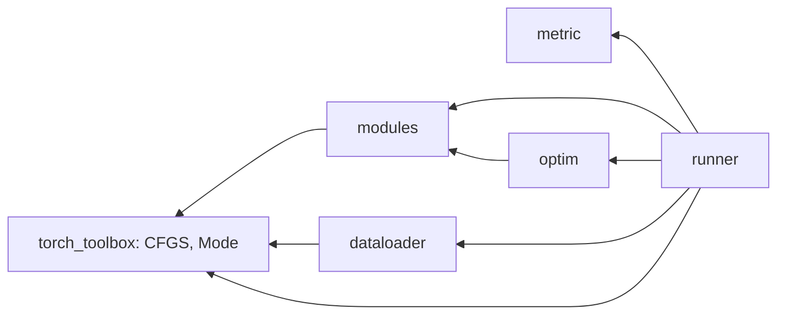

# torch_toolbox

Config 선언 -> registry 조립으로 모델, 데이터, 학습 파이프라인을 구성하는 PyTorch 기반 코드. 미완 항목은 `TODO.md`.

## 구조

| 주제 | 아는 것 | 모르는 것 | src | test |
| --- | --- | --- | --- | --- |
| 공통 | `CFGS` (Config registry), `Mode` (train, val, test) | 전부 | `torch_toolbox/__init__.py` | - |
| 조립 엔진, 모델, 손실, 변환 | Config -> nn.Module 재귀 조립, 동일 계층 차원 해석 | 데이터, 학습 루프 | [`modules/`](torch_toolbox/modules/README.md) | - |
| 데이터 | Dataset, DataLoader 조립, sampler | 모델 | [`dataloader/`](torch_toolbox/dataloader/README.md) | - |
| 평가 지표 | batch 출력 누적 (Accumulator), stateless 지표 | 모델, 데이터 | [`metric/`](torch_toolbox/metric/README.md) | - |
| 최적화 | 파라미터 그룹별 optimizer, scheduler, `SCHEDULER` registry | 데이터, 루프 | `torch_toolbox/optim/` | - |
| 실행 | 위 전부의 조립 (Assembler), 루프, DDP, 체크포인트, export | 컴포넌트가 무엇인지 | [`runner/`](torch_toolbox/runner/README.md) | - |

방향 검사 : `modules`, `dataloader`, `metric` 은 서로 import 안 함. `optim` -> `modules`. `runner` 만 전부 import.

## 기반

| 무엇 | 종류 | 쓰는 곳 |
| --- | --- | --- |
| `Base_Config` (`python_toolbox`) + `@dataclass` | Config 기반. 순수 데이터, 사이드이펙트 없음, 직렬화. 같은 Config -> 같은 컴포넌트 | 모든 Config |
| `Registry` | 문자열 키 등록, 조회. 확장 = 클래스 + 데코레이터, 기존 코드 수정 없음. `config_type` -> `CFGS`, `object_type` -> 축 registry | `CFGS`, `MODELS`, `LOSSES`, `DATASETS`, `DATALOADER_FN`, `ACCUMULATORS`, `SCHEDULER` |
| Config / Module / Builder 분리 | Config 는 선언만, Module 은 Config 모름 (`Build(**kwargs)`), Builder 가 registry 조회 + 인스턴스화 | 전 축 |
| 파일 역할 | `definition.py` = Config, 추상 클래스 / `build.py` = Builder / `runtime.py` = Runner | 전 축 |
| `Composable_Config.sub_module_meta` + `Build_from_registry` | 하위 Config 선언, 자식 먼저 재귀 빌드 후 부모 `Build(**sub_modules)` 에 주입 | `modules`, `runner/supervised` |
| `Trainable_Model` | 모듈별 lr, weight_decay override -> 파라미터 그룹 | `modules`, `optim` |

## 작업 흐름

| 대상 | 담는 것 | 추가 의존 |
| --- | --- | --- |
| 설치 | `pip install -e .` | python >= 3.11, `python_toolbox` (git, HUB 브랜치), `pyproject.toml` 의 torch, timm, onnx 계열 |
| 실행 | `runner.Runtime_init` : hub YAML -> runner 인스턴스 | CUDA GPU. 2개 이상이면 DDP (nccl) |
