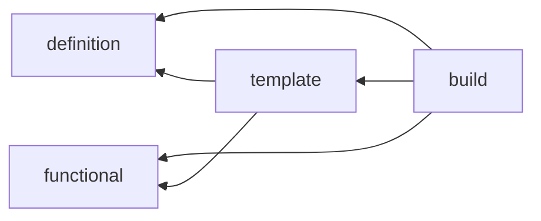

# dataloader

Dataset, DataLoader 조립. mode 별 설정 하나에서 loader 하나.

## 구조

| 자리 | 아는 것 | 모르는 것 |
| --- | --- | --- |
| `__init__.py` | `DATASETS`, `DATALOADER_FN` (collate) registry | - |
| `definition.py` | `Dataset_Config` (`data_kwargs` 는 `Builder` 인자로 언패킹), `Dataloader_Config`, `Custom_Dataset` (`Builder`, `Info_for_onnx`) | 모델 |
| `build.py` | `Build_dataset`, `Build_dataloader` : registry 조회, DDP sampler, PK sampler, collate | 데이터 형식 |
| `functional/` | ImageNet transform, `PK_Batch_Sampler` (클래스 P x 표본 K 배치) | Dataset |
| `template/classification/` | `Classification_Dataset` 공통, 이미지 구현 | 다른 태스크 |
| `template/detection/` | `COCO_Dataset` 스텁 | - |

방향 검사 : `template` 은 `definition`, `functional` 만 import. `definition` 은 `build`, `template` 을 모름.
