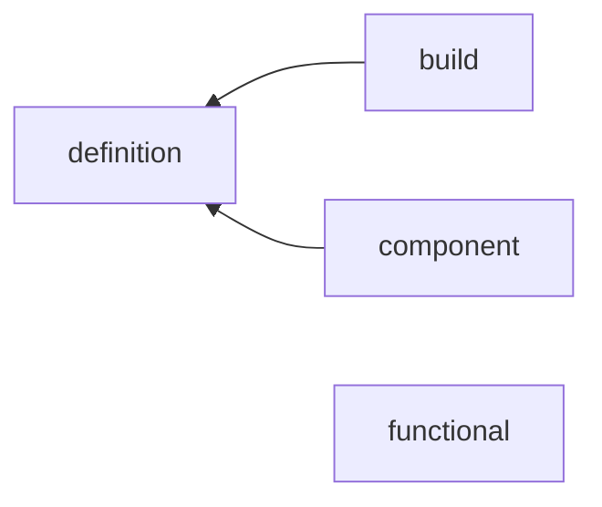

# metric

평가 지표. batch 출력을 누적하는 stateful accumulator 와 stateless 함수.

## 구조

| 자리 | 아는 것 | 모르는 것 |
| --- | --- | --- |
| `__init__.py` | `ACCUMULATORS` registry | - |
| `definition.py` | `Accumulator` 계약 (`Update`, `Finalize`, `Reset`), `Assemble_Metric` (mode 하나의 accumulator 묶음). `Update` 는 `_Forward` 출력을 kwargs 로 받아 필요한 키만 | 모델, runner |
| `build.py` | `Build_metric` : Config -> accumulator 인스턴스 | 누적 방식 |
| `component/` | scalar (평균, 발산 판정), centroid (클래스 중심), scatter (클래스 내 산포, OAS shrinkage) | stateless 지표 |
| `functional/` | 분류 (top-k, confusion), 회귀 (acc, AUC), 벡터 (cosine, vMF, theta 축 순환 정합) | 누적, registry |

방향 검사 : `functional` 은 torch 만 import. `component` 는 `definition` 만.
