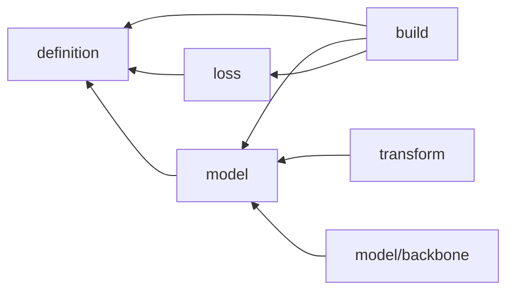

# modules

Config -> nn.Module 조립 엔진과 조립 대상 (모델, 손실, 변환).

## 구조

| 자리 | 아는 것 | 모르는 것 |
| --- | --- | --- |
| `__init__.py` | `MODELS`, `LOSSES` registry | - |
| `definition.py` | Config 뼈대 (`name`, `config_type`, `object_type`, `trainable`, `sub_module_meta`), `Composable_Module` (생성 시 `Build` 호출, `Out_channels` 계약, 부분 가중치 로드) | registry, 하위 도메인 |
| `build.py` | `Build_from_registry` : 자식 먼저 재귀 조립. 동일 계층 차원 표현식 (`backbone`, `backbone[0]`, `$키`, `{sum: [...]}`) 을 앞 형제의 `Out_channels()` 와 외부 context 로 해석 | 모듈 내부 |
| `model/` | `Trainable_Model` (모듈별 lr, wd -> 파라미터 그룹), [백본 래퍼](model/backbone/README.md) | 손실, 데이터 |
| `loss/` | `Assemble_Loss` (항별 손실 조립), `component/` 손실 항, `functional/` 순수 함수 | 모델 |
| [`transform/`](transform/README.md) | 마스크, 이미지 -> 모델 입력 변환. functional + state layer | 백본, 손실 |

방향 검사 : `model`, `loss`, `transform` 은 `definition` 과 `model/definition` 만 import. 하위 도메인을 import 하는 것은 `build` 뿐 (`transform` 은 import 안 함 - 소비처 import 로 등록).
