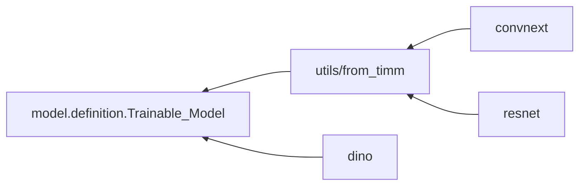

# backbone

사전학습 백본 래퍼. 다단 feature, 채널 수, stride 를 계약 메서드로 노출.

## 구조

| 자리 | 아는 것 | 모르는 것 |
| --- | --- | --- |
| `utils/from_timm.py` | `Timm_Feature_Backbone` : timm `features_only` 공통 구현 (빌드, forward, 계약 메서드, 부분 unfreeze) | variant 이름 |
| `convnext.py`, `resnet.py` | `VARIANTS` : 공개 이름 -> timm 모델명 (태그 포함) | 빌드, forward |
| `dino.py` | DINO ViT 래퍼. `Trainable_Model` 직접 상속 | `Timm_Feature_Backbone` |
| `__init__.py` | `BACKBONES`, `BACKBONE_CFGS` 타입 묶음 | - |

방향 검사 : variant 파일은 `utils/from_timm` 또는 `model.definition` 만 import. variant 끼리 import 없음.
