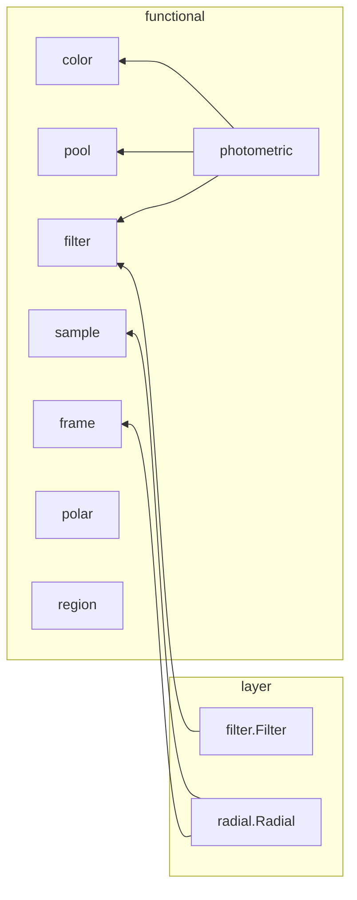

# transform

마스크, 이미지 -> 모델 입력 변환. torch 단일 소스라 학습, 추론, 배포가 같은 그래프.

## 구조

| 자리 | 아는 것 | 모르는 것 |
| --- | --- | --- |
| `functional/color.py` | RGB 채널, 휘도 가중치, 포화 램프, 색비 log | 이웃 화소 |
| `functional/pool.py` | box 창 평균, 가중 평균, 국소 평균/표준편차, 축소 격자 가중 저역 | 채널 의미 |
| `functional/filter.py` | Sobel, LoG 샤프닝 커널 생성, 채널별 depthwise conv | 커널 선택 |
| `functional/sample.py` | 정수 격자점 gather | 좌표계 |
| `functional/frame.py` | 마스크 격자, `trust_radius`, 2차/3차 모멘트 -> `Frame` (centroid, 주축각, 신뢰도), 정렬 좌표 (u, v) | 극좌표 격자 |
| `functional/polar.py` | 극좌표 occupancy `(NR, NT)`, 반경 1 px -> 프로파일, RLE, 면적 총량 | 마스크 좌표, 정렬 |
| `functional/region.py` | 정렬 좌표 (u, v), `r_outer` -> 크기, 비율, 위치, 카이랄, 3차 모멘트 | 극좌표 격자 |
| `functional/photometric.py` | color, pool, filter 조합. roi, 포화 -> 조명 정규화, 면 잔차, 국소 대비 | 마스크 |
| `filter.py` | `Filter` : 커널 뱅크 (state), 이름 -> 커널 slice | 입력 채널 수 |
| `radial.py` | `Radial` : 오프셋 LUT (state), `Frame.origin`, `Frame.angle` -> `(B, NR, NT)` | 캔버스 크기, 측정 |
| `old/` | 소비처 없는 것의 보관. 누구도 import 안 함. 방향 검사, 등록, 동작 보장 밖 | - |

방향 검사 : `functional/` 은 torch 만 import (예외 `photometric` -> `color`, `pool`, `filter`). layer 는 `functional/` 만, layer 끼리 import 없음. `functional/` 에 `nn.Module` 없음. layer 는 파생 buffer 보유.

## 계약

- layer = 생성자 인자에서 계산해 호출마다 재사용하는 텐서 (state) 보유. Config + `MODELS` 등록
- functional = state 없음. 출력을 바꾸는 인자는 기본값 없는 keyword-only. 예시 값은 호출하는 쪽 (layer Config, 소비처 config)
- 코드 상수는 정의 상수 (Sobel 계수) 와 퇴화 입력에서만 작동하는 수치 가드뿐
- 이름 가변 호출 (`Filter`) 은 이름들이 state 하나를 공유해 연산 하나로 합쳐질 때만
- 출력 shape 은 함수 docstring `Returns`. 차원 선언 객체 없음. 재도입 조건 : 조립기가 forward 없이 노드 간 차원을 추론해야 할 때
- 길이 단위는 도메인 단위 u. `trust_radius` (u, 정수) = `NR`, 반경 간격 1 u, 좌표 무차원화 `norm = trust_radius / px_size` (입력 px). 마스크 사슬 전체가 같은 값
- `norm` 이 값에 남는 출력은 `Chirality_moments` 의 3차 모멘트뿐. `Region_scalars` 는 되곱해 u
- 캔버스 크기는 값에 안 남음. 격자를 입력 크기에서 만들고 오프셋 LUT 를 centroid 에 더해 읽음
- 물리 정보는 `px_size` (입력 1 px 의 길이 / u) 하나. u 가 몇 mm 인지는 소비처. 입력을 리샘플하지 않고 측정이 입력 격자를 subsample
- `px_size` 상한 1. 입력이 u 보다 거칠면 raise - 보간으로 없는 표본을 만들지 않음
- 길이 단위는 하나. 축별 배율 없음 - 이방 격자 미지원
- 표본 밀도는 `Radial.sub_per_px` (입력 1 px 당 축별 표본 수). 카메라가 바뀌어도 px 당 밀도 불변
- 출력은 raw (u, 무차원 비). 정규화는 소비처
- 입력 마스크는 fill, 최대연결성분, 정렬을 하지 않은 {0, 1}. 관통 구멍은 형상 정보
- 정렬은 유일한 대표 자세가 아님. 대칭 형상은 각도 미결정 (n >= 3 회전대칭 `Z2 = 0`, 2회 대칭 `Z3 = 0`). `Frame.anisotropy`, `Frame.flip_margin` 이 미결정성을 보고
- ONNX : torch -> ONNX -> TensorRT. 전부 배포 그래프에 남음. exporter, opset 은 소비처 설정
  - torch 텐서 연산만. numpy, cv2, scipy 없음
  - 텐서 값에 따른 Python 분기, `.item()`, `.tolist()`, `int(tensor)` 없음. 반복 횟수는 인자 상수 (그래프에 펼침)
  - 값에 따라 shape 이 정해지는 연산 없음 (boolean 인덱싱, `nonzero`, `unique`). `torch.where` 로 대체
  - 입력 shape 에서 도출한 크기 (창, 커널, 채널 수) 는 Python int. 고정 shape export 전제
  - 상수 텐서는 입력 device, dtype 을 따라 생성
  - `GridSample` 없음 (TRT INT8 불가), `torch.hypot` 없음, reflect 패딩 폭 < 입력 변
- FP16 : 합 대신 평균의 비. px^2 이상 중간값 없음. 리덕션은 무차원 좌표로 mean
