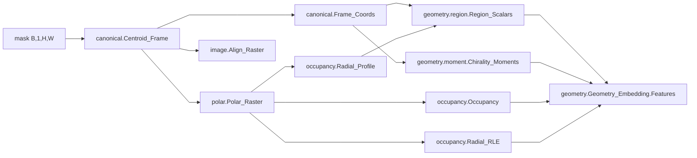

# transform/mask

실루엣 이진 마스크 -> 형상 토큰. torch 단일 소스. 학습, 추론, 배포, 평가가 같은 그래프.

## Structure

| Slot | knows | does not know |
| --- | --- | --- |
| `canonical.py` | 마스크 격자, `trust_radius`(길이 단위), 2차/3차 모멘트 | 극좌표 격자, 서술자 |
| `polar.py` | `Frame.origin/angle`, 오프셋 LUT (`trust_radius` x `num_angular` x `sub`) | 캔버스 크기 (forward 에서 읽음), 서술자 |
| `occupancy.py` | 극좌표 occupancy 격자 (NR, NT), 반경 단위 1 px | 마스크 좌표, 정렬 |
| `geometry/region.py`, `geometry/moment.py` | 정렬 좌표 `(u, v)`, `Region_Profile` | 극좌표 격자 |
| `geometry/spec.py` | `Feature_Spec` (차원, 범위) | 값 |
| `geometry/profile.py`, `geometry/fourier.py` | 프로파일 통계, Fourier 서술자. 토큰 스키마에서 제외, 조립 안 됨 | - |
| `geometry/__init__.py` | 위 전부의 조립과 도메인 묶기 (`DATA_GROUP`, `RADIAL_FOLDS`) | 소비처의 병합, 정규화 |
| `silhouette.py` | `Center_Crop`, `Resize_Binarize` | 그 뒤 |
| `image.py` | `Align_Raster`, `Image_Channels` (래스터 정렬, 채널 스택) | geometry |

방향 검사 : `geometry/` 는 `canonical`, `polar`, `occupancy` 를 import 하고 그 역은 없음.

## 계약

- 길이 단위 상수는 `trust_radius` 하나 (px, 정수). 반경 격자 간격 1 px, `num_radial = trust_radius`,
  좌표 무차원화 `norm = trust_radius`. 실루엣 사슬 전체가 같은 값
- 캔버스 크기는 값에 안 남음. 격자를 입력 크기에서 만들고 오프셋 LUT 를 centroid 에 더해 읽음.
  crop 없이 프레임 전체를 넣어도 같은 토큰. `dynamic_axes` H, W 로 export
- 현장 배율(기준 카메라 px 대 현장 px)은 여기 없음. 소비처가 입력을 기준 px 로 리샘플해 넣음
- 출력은 raw (px, 무차원 비). 정규화는 소비처가 선형 scale 로
- 입력 마스크는 fill, 최대연결성분, 정렬을 하지 않은 {0, 1}. 관통 구멍은 형상 정보
- 정렬은 정준 자세가 아님. 대칭 형상은 각도 미결정 (n >= 3 회전대칭 `Z2 = 0`, 2회 대칭
  `Z3 = 0`). `Frame.anisotropy`, `Frame.flip_margin` 이 그 미결정성을 보고. 소비처가 값으로 판단
- FP16 : px^2 이상을 만들지 않음. 리덕션은 무차원 좌표로 mean
- ONNX : `Gather`, `Mul`, `Add` 로 극좌표 리샘플. `GridSample` 없음. `torch.hypot` 없음
