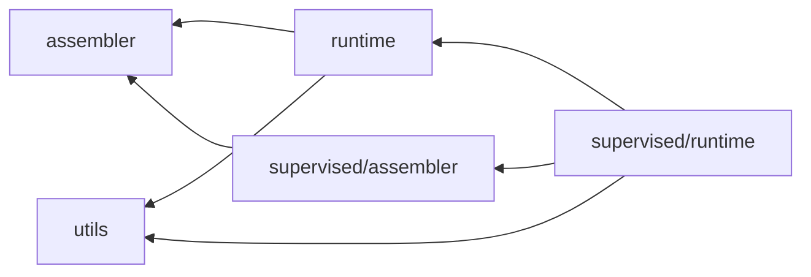

# runner

학습, 평가, export 실행. 조립은 Assembler (1회), 반복은 Runner.

## 구조

| 자리 | 아는 것 | 모르는 것 |
| --- | --- | --- |
| `__init__.py` | `Runtime_init` : hub YAML -> runner 인스턴스. `Resolve_config` : YAML 값 해석 | 루프 |
| `assembler.py` | `Component_Assembler` : `mode_meta` -> `mode_cfg` (선언된 mode 만, `use_grad` 는 TRAIN 만), mode 별 dataloader, metric 조립, AMP, grad clip 상한. 도메인 컴포넌트는 `_Build` 로 하위가 추가 | model, loss, optim 의 종류 |
| `runtime.py` | `Base_Runner` : DDP 셋업 (`set_device` 먼저, rank, world_size), spawn, 템플릿 루프, 체크포인트 선택 (`resume_selection`, `eval_selection`), export. 코어 (`_Process_context`, `__Process`) 는 override 금지, protected hook (`_Setup`, `_Iter_hook`, `_Forward`, `_Should_stop`, `_Save_checkpoint`, `_Prepare_export_artifacts`) | 컴포넌트가 무엇인지. Assembler 가 dict 로 건넴 |
| `supervised/` | `Supervised_Assembler` : model, loss, optim Config 와 조립, 차원 context, 체크포인트 복원. `Supervised_Runner` : `_Iter_hook` 고정, `_Forward` 가 사용자 진입점 -> `(loss, batch_size, output_dict)`, `output_dict` 는 accumulator 로 | 다른 학습 형태 |
| `utils/` | 로그 기록, 체크포인트 경로 해석 (`Iter_Selection`), 분산 metric reduce | runner 클래스 |

방향 검사 : `runtime`, `assembler` 는 `modules`, `optim` 을 모름. `supervised/` 만 `modules`, `optim` import.
